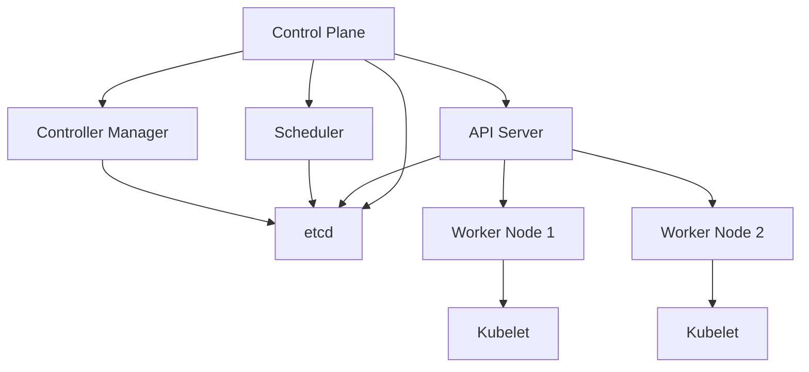
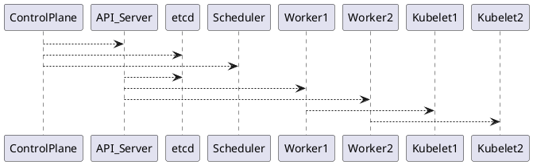

# Architecture Diagrams

This document describes the architecture diagrams for the Kubernetes cluster. Use these descriptions to create visual diagrams using tools like draw.io, Mermaid, or PlantUML.

## Cluster Architecture

### High-Level Cluster Topology

```sh
┌─────────────────────────────────────────────────────────────┐
│                    Kubernetes Cluster                        │
├─────────────────────────────────────────────────────────────┤
│                                                               │
│  ┌─────────────────────────────────────────────────────┐   │
│  │              Control Plane Node                      │   │
│  │  ┌──────────┐  ┌──────────┐  ┌──────────┐          │   │
│  │  │ API      │  │ etcd     │  │ Scheduler│          │   │
│  │  │ Server   │◄─┤          │  │          │          │   │
│  │  └────┬─────┘  └──────────┘  └────┬─────┘          │   │
│  │       │                           │                  │   │
│  │  ┌────▼─────┐  ┌──────────┐  ┌────▼─────┐          │   │
│  │  │ Controller│ │ Cloud    │  │ Kubelet  │          │   │
│  │  │ Manager  │  │ Controller│ │          │          │   │
│  │  └──────────┘  └──────────┘  └──────────┘          │   │
│  └─────────────────────────────────────────────────────┘   │
│                           │                                 │
│                           │ API Calls                       │
│                           │                                 │
│  ┌────────────────────────▼─────────────────────────────┐   │
│  │              Worker Node 1                            │   │
│  │  ┌──────────┐  ┌──────────┐  ┌──────────┐          │   │
│  │  │ Kubelet  │  │ Kube-    │  │ Container │          │   │
│  │  │          │  │ proxy    │  │ Runtime   │          │   │
│  │  └────┬─────┘  └──────────┘  └────┬─────┘          │   │
│  │       │                           │                  │   │
│  │  ┌────▼─────┐  ┌──────────┐  ┌────▼─────┐          │   │
│  │  │ API      │  │ Worker   │  │ Redis    │          │   │
│  │  │ Service  │  │ Service  │  │          │          │   │
│  │  └──────────┘  └──────────┘  └──────────┘          │   │
│  └─────────────────────────────────────────────────────┘   │
│                                                               │
│  ┌─────────────────────────────────────────────────────┐   │
│  │              Worker Node 2                            │   │
│  │  ┌──────────┐  ┌──────────┐  ┌──────────┐          │   │
│  │  │ Kubelet  │  │ Kube-    │  │ Container │          │   │
│  │  │          │  │ proxy    │  │ Runtime   │          │   │
│  │  └────┬─────┘  └──────────┘  └────┬─────┘          │   │
│  │       │                           │                  │   │
│  │  ┌────▼─────┐  ┌──────────┐  ┌────▼─────┐          │   │
│  │  │ API      │  │ Worker   │  │ PostgreSQL│         │   │
│  │  │ Service  │  │ Service  │  │          │          │   │
│  │  └──────────┘  └──────────┘  └──────────┘          │   │
│  └─────────────────────────────────────────────────────┘   │
│                                                               │
└─────────────────────────────────────────────────────────────┘
```

## Request Flow Diagrams

### Pod Creation Flow

```sh
User (kubectl)
    │
    │ POST /api/v1/namespaces/production/pods
    ▼
┌─────────────────┐
│   API Server    │
│  - Authenticate │
│  - Authorize    │
│  - Validate     │
└────────┬────────┘
         │
         │ Write
         ▼
┌─────────────────┐
│      etcd       │
│  Store Pod Spec │
└────────┬────────┘
         │
         │ Watch
         ▼
┌─────────────────┐
│    Scheduler    │
│  - Filter Nodes │
│  - Score Nodes  │
│  - Bind Pod     │
└────────┬────────┘
         │
         │ Update etcd
         ▼
┌─────────────────┐
│      etcd       │
│  Update Pod     │
└────────┬────────┘
         │
         │ Watch
         ▼
┌─────────────────┐
│    Kubelet      │
│  - Create Pod   │
│  - Start Contain│
└────────┬────────┘
         │
         │ Status Update
         ▼
┌─────────────────┐
│   API Server    │
│  Update Status  │
└─────────────────┘
```

### Service Request Flow

```sh
Client Pod
    │
    │ DNS Query: api-service.production.svc.cluster.local
    ▼
┌─────────────────┐
│    CoreDNS      │
│  Resolve to     │
│  ClusterIP      │
└────────┬────────┘
         │
         │ Request to ClusterIP
         ▼
┌─────────────────┐
│   Kube-proxy    │
│  iptables Rules │
└────────┬────────┘
         │
         │ Load Balance
         ▼
┌─────────────────┐     ┌─────────────────┐     ┌─────────────────┐
│  API Pod 1      │     │  API Pod 2      │     │  API Pod 3      │
│  10.244.1.5     │     │  10.244.2.3     │     │  10.244.3.7     │
└─────────────────┘     └─────────────────┘     └─────────────────┘
```

## Component Interaction Diagram

```
┌─────────────────────────────────────────────────────────────┐
│                      Control Plane                            │
├─────────────────────────────────────────────────────────────┤
│                                                               │
│  ┌──────────────┐         ┌──────────────┐                  │
│  │ API Server   │◄────────┤    etcd      │                  │
│  │              │  Read/  │              │                  │
│  │              │  Write   │              │                  │
│  └──────┬───────┘         └──────────────┘                  │
│         │                                                    │
│         │ Watch                                             │
│         │                                                    │
│  ┌──────▼───────┐         ┌──────────────┐                  │
│  │ Controller   │         │  Scheduler   │                  │
│  │ Manager      │         │              │                  │
│  │              │         │              │                  │
│  └──────────────┘         └──────────────┘                  │
│                                                               │
└─────────────────────────────────────────────────────────────┘
         │                    │                    │
         │ API Calls          │ API Calls          │ API Calls
         │                    │                    │
┌────────▼────────┐  ┌────────▼────────┐  ┌────────▼────────┐
│  Worker Node 1  │  │  Worker Node 2  │  │  Worker Node 3  │
│                 │  │                 │  │                 │
│  ┌──────────┐   │  │  ┌──────────┐   │  │  ┌──────────┐   │
│  │ Kubelet  │   │  │  │ Kubelet  │   │  │  │ Kubelet  │   │
│  └────┬─────┘   │  │  └────┬─────┘   │  │  └────┬─────┘   │
│       │         │  │       │         │  │       │         │
│  ┌────▼─────┐   │  │  ┌────▼─────┐   │  │  ┌────▼─────┐   │
│  │Container │   │  │  │Container │   │  │  │Container │   │
│  │ Runtime  │   │  │  │ Runtime  │   │  │  │ Runtime  │   │
│  └──────────┘   │  │  └──────────┘   │  │  └──────────┘   │
└─────────────────┘  └─────────────────┘  └─────────────────┘
```

## Network Architecture

```sh
┌─────────────────────────────────────────────────────────────┐
│                      Pod Network                             │
│                   10.244.0.0/16                              │
├─────────────────────────────────────────────────────────────┤
│                                                               │
│  Pod 1 (10.244.1.5)    Pod 2 (10.244.2.3)    Pod 3 (10.244.3.7)│
│       │                      │                      │        │
│       └──────────────────────┼──────────────────────┘        │
│                              │                                │
│                         ┌────▼─────┐                         │
│                         │  Calico  │                         │
│                         │   CNI    │                         │
│                         └────┬─────┘                         │
│                              │                                │
│                         ┌────▼─────┐                         │
│                         │  Node    │                         │
│                         │ Network  │                         │
│                         └──────────┘                         │
│                                                               │
└─────────────────────────────────────────────────────────────┘
```

## etcd Data Structure

```sh
/registry
│
├── pods
│   └── production
│       ├── api-service-xxx
│       ├── worker-service-yyy
│       └── ...
│
├── services
│   └── production
│       ├── api-service
│       └── worker-service
│
├── nodes
│   ├── control-plane
│   ├── worker-1
│   └── worker-2
│
├── secrets
│   └── production
│       └── postgres-credentials
│
└── configmaps
    └── production
        └── api-config
```

## Failure Recovery Flow

```sh
Failure Detected
    │
    ▼
┌─────────────────┐
│  Identify Type  │
│  - Pod Eviction │
│  - Node Failure │
│  - Control Plane│
│  - etcd Failure │
└────────┬────────┘
         │
         ▼
┌─────────────────┐
│  Assess Impact  │
│  - Scope        │
│  - Services     │
│  - Data Loss    │
└────────┬────────┘
         │
         ▼
┌─────────────────┐
│  Execute        │
│  Recovery       │
│  Procedure      │
└────────┬────────┘
         │
         ▼
┌─────────────────┐
│  Verify         │
│  - Health       │
│  - Services     │
│  - Data         │
└────────┬────────┘
         │
         ▼
┌─────────────────┐
│  Document       │
│  - Root Cause   │
│  - Actions      │
│  - Prevention   │
└─────────────────┘
```

## Creating Visual Diagrams

### Using Mermaid (GitHub/Markdown)



### Using PlantUML



### Using draw.io

1. Go to [https://app.diagrams.net/](https://app.diagrams.net/)
2. Create new diagram
3. Use the descriptions above to create visual representations
4. Export as PNG or SVG

## Diagram Checklist

- [ ] Cluster topology diagram
- [ ] Request flow diagrams
- [ ] Component interaction diagram
- [ ] Network architecture diagram
- [ ] etcd data structure diagram
- [ ] Failure recovery flow diagram
- [ ] Pod lifecycle diagram
- [ ] Service discovery diagram
